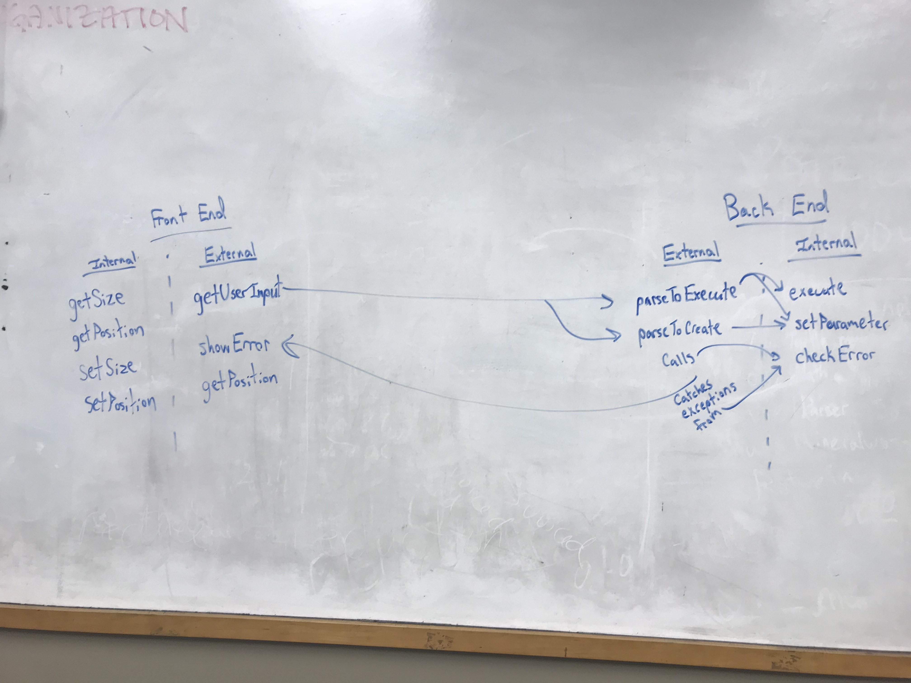
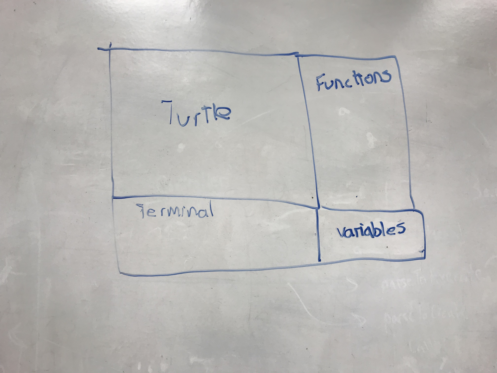

# Introduction

We are trying to create a Java program using OpenJFX that provides an integrated development environment, IDE, that supports users to write SLogo programs. This program will support the use of various pre-defined functions, as well as the ability for a user to create new functions to change the behavior of a turtle graphic. The IDE should focus on helping users to experiment with and manage expressions, building up complex expressions from previously entered ones and keeping the visual representation of the turtle appropriately updated.

The program should be the most flexible in allowing the user to define their own functions, which is functionality that will reside in the backend. We plan for the project to be open to adding more pre-defined functions and a extensions to the view of the IDE. Ideally, the use of an effective high end data transfer mechanism will allow the communication between the front end and the backend to remain constant as the program is extended to add functionality to the backend and update display attributes.

# Design Overview

4 APIs - 

##### Internal Frontend (interface with different parts of the frontend)

Makes sure all frontend objects effectively communicate and remain updated in the display.

*  Class (all functions below are applicable to each object displayed on the screen)
    * getSize()
    * getPosition()
    
##### External Frontend

Provides necessary information so that backend can implement the logic for state change. Allows the backend to get the current state of the frontend to update the display accordingly with logic the backend executes on the user input.

* Turtle Class
    * updatePosition()
    * getPosition()
    * getOrientation()
    * updateOrientation()

* UserInput Class
    * getUserInput()
    * This class communicates with the parser class in the external backend.
    
* Error Class
    * showError()
    
##### Internal Backend (interface with different parts of the backend)

Provides the logic for executing change and detecting errors.

* ErrorChecking Class - called somewhere from the external backend
    * checkError() - Takes in a string of user input and throws the correct exception if there is one.
    * Calls showError in the external frontEnd
    
* Each subclass of Function will have:
    * execute() to be called by the parser. This class communicates with the turtle class in the external frontend.
    * setParameter() to be called by the parser.

##### External Backend

Allows frontend to communicate with updated backend data.

* Parser Class - takes input information from the external frontend.
    * parseToCreate() - Parse multiple lines of user input to create a new user-defined function.
    * parseToExecute() - Parse user-inputted code to traverse the map and call the excute() function for the given function. 
    * Holds a map that maps String keys (the function, pre-defined or user-defined) to an arrayList of all pre-defined functions that it uses.
    
# User Interface

 Describe the overall appearance of program's user interface components and how users interact with these components (especially those specific to your program, i.e., means of input other than menus or toolbars). 
 
 Include one or more pictures of the user interface. Describe any erroneous situations that are reported to the user (i.e., bad input data, empty data, etc.).

* Display of turtle
* Display of variables
* Terminal (will be scrollable)
* A list of pre-defined function (or past user-defined functions) - when one of these is added, it provides text in the terminal and parameters must be inputted. This will be a list of buttons.
* Buttons
    * Execute - when pressed, executes what is in the terminal.
    * Create - when pressed, what is typed in the terminal is added to the list of function.
    * Create and execute - combines both of the above, in that order.
    * History - when clicked, a file with the history of code is presented.
    * Help - provides a file with command references.
    
 Users can:
 (a) click on one of the pre-defined functions, which will auto-fill the terminal with the function, parameters not included.
 (b) write a new function and press the "create" or "execute and create" buttons. They do this using pre-defined functions in the functions list.
 (c) write many lines of code (scrollable) and execute them without necessarily saving them as a function.
 
 An error will be displayed in a popup window when unknown function are typed, an incorrect number of parameters are typed in, and when syntax is incorrect.

# API Details

##### External Backend

The external backend API allows the external frontend to communicate with the backend and update data regarding functions. The API has one class - the Parser class. The Parser takes user input, interprets it, and has the capability to (a) update the master map containing all existing functions (including pre-defined functions and previously defined user-created functions) by adding a new user-created function and/or (b) execute the given function. The map will be pre-set to contain all pre-defined functions, and as users create new functions, their keys will be matched with an arrayList giving the order of functions to be executed. The class has to main functions: 

   * parseToCreate() - This parses multiple lines of code to create a new user-defined function utilizing pre-defined functions in a specific order. The order of functions is put into an arrayList in the map.
   * parseToExecute() - Parses user-inputted code to traverse the map and call runFunction() function for the correct key in the map. This calls the execute() function for every sub-function (which extends the Function abstract class) in the arrayList its key maps to (for pre-defined functions, this is just one sub-function).

This API is intended to be used by the external front end to communicate user input to the backend and to save function data. It can easily be extended to support different types of languages (its parsing method would be different, but the functionality would be the same). It can also be extended infinitely to include new functions. We want the functionality of parsing data to be abstracted to provide a high level outline for how parsing should flow, regardless of the type of data. The implementation should be a black box in the eyes of the frontend - the frontend simply calls API methods of the Parser and its state is updated without having to worry about the logic.

#### Internal Backend

The internal portion of the backend is largely built up of functions (members of the Function superclass). This portion of the API mostly offers functionality for checking the validity of user input strings and modifying parameters based on user input. The Function superclass and its subclasses will build up this class, along with an error checking class (ErrorChecker). ErrorChecker performs a series of tests on the user input string to validate its validity in checkError. If the string is valid, checkError returns 0. Otherwise, a number will be returned and an IllegalArgumentException will be thrown. The ErrorChecker class will offer methods to check for valid syntax, command inputs, and more (all executed in the checkError method). The Function hierarchy performs simple modifications to environment variables and objects.

* setParameter(int parameter) - Called from the external backend with information (parameter) from the external front end to set a Function class parameter.
* execute() - Called from the external backend AFTER setParameter to execute the functionality of a command.
* checkError(String userText) - Called from the external backend with information (string of user input) from the external front end to check for a variety of errors in the user text by calling several internal error checking methods.

##### External Frontend

The external frontend API allows the backend to access data belonging to frontend classes. In order for the backend to execute logic and functions correctly, it needs access to the current state of front end objects. There are three main parts to this class: turtle information, user input, and error showing. The backend needs the ability to determine the position and orientation of the turtle in order to determine its new state based on the user functions. After completing these functions, the backend should also have the ability to set a new position and orientation for the turtle to keep the information up to date. 

Additionally, the backend needs access to the user input. The getUserInput() method will return a String of the user's input to the parser, which in turn will decode the text into the proper functions that the backend will then call. This method allows the backend to get the information that is necessary to actually execute different functions. 

Lastly, the external frontend will need a way to display errors generated from the backend. This allows the user to know if they have provided bad input to the system. Instead of crashing the system, or having nothing happen, by displaying an error message, the user will know exactly what was wrong with their input. 

See API Interface for more details. 

##### Internal Frontend

This API allows different frontend objects to communicate with one another. As of now, this API only contains a getSize and getPosition method that allows objects on the screen to know where they are in relation to other objects. As we begin to code and understand how JavaFx frontend works (all of us were on backend for Cell Society), we will add more methods to this API to increase functionality. We will need to keep each other updated on the status of this API to ensure everyone is using the full functionality this provides. 

See API Interface for more details. 

# API Example Code

* The user types 'fd 50' in the command window, and sees the turtle move in the display window leaving a trail, and the command is added to the environment's history.

        * .getUserInput(fd 50) - for backend and history
        * Parser.parseToExecute()
        * ErrorChecking.checkError() if needed. Then showError() within if needed.
        * Parser.parseToExecute() calls Function.execute() and Function.runFunctions()
        * within each execute():
               - Scene.getPosition()
               - Turtle.updatePosition()
               - Turtle.getOrientation()
Jamie - 

* The user types a combination of the original commands in the command window, and presses the "create" button.
       
        * Scene.getUserInput() - for backend and history
        * Parser.parseToCreate() - creates List of functions in order corresponding to the user-written commands. This is put into the map and allows the user to call it again.
            * ErrorChecking.checkError() if needed. Then showError() within if needed.
        * Scene - Add new user-created function to side bar of functions
        * within each execute():
               - Scene.getPosition()
               - Turtle.updatePosition()
               - Turtle.getOrientation()
               
* The user types a new combination of the hardcoded commands in the command window, and presses the "execute" button.
       
        * Scene.getUserInput() - for backend and history
        * Parser.parseToExecute() - calls Function.setParameter, Function.execute(), and Function.runFunctions() on the string the user named the new function as
        * ErrorChecking.checkError() is needed because the given function is not yet in the master map of functions. Then showError() is called within.               

Eric - 

* The user types in a command that does not exist into the command line and clicks the "execute" button.
 
    * getUserInput() is called to send the string to the backend parser
    * parseToExecute() is called to parse the string into a format that can execute functions
    * checkError() is called to check if the user has input a valid command/sequence of commands
    * showError() is called when none of the commands in the Map match the format of the user input
    

* The user inputs backward 50 and clicks "execute" 

    * getUserInput() is called to send the user input to the backend parser
    * parseToExecute() is called to convert the user input into a format that is usable by functions
    * checkError() is called to ensure the user has input a string that matches the format of a defined command
    * within execute
        - getPosition() and getOrientation() to determine current state of Turtle
        - setPosition() to determine new position of the Turtle

Mary Stuart - 
* The user types '[ fd 50 rt 90 ]' in the command window, clicks "execute", and sees the turtle move in the display window leaving a trail, and the command is added to the environment's history.
    * Scene.getUserInput() - for backend and history
    * Parser.parseToExecute() - calls Function.setParameter, Function.execute(), and Function.runFunctions() on the for each function listed by string in the user input
    * ErrorChecking.checkError() - then showError() within if needed.
    * within each execute():
        - Scene.getPosition()
        - Turtle.updatePosition()
        - Turtle.getOrientation()
* The user types '# This is my command' in the command window, clicks "execute", and sees no change in the display window, and the command is added to the environment's history.
    * Scene.getUserInput() - for backend and history.
    * Parser.parseToExecute() - this method will recognize the # symbol in the user input as a comment symbol and not make a call to Function.runFunctions(). The API portion of work is complete.

Jorge - 
* The user types a combination of the original commands in the command window, and presses the "execute and create" button.
       
        * Scene.getUserInput() - for backend and history
        * Parser.parseToCreate() - creates List of functions in order corresponding to the user-written commands. This is put into the map and allows the user to call it again.
            * ErrorChecking.checkError() if needed. Then showError() within if needed.
        * Scene - Add new user-created function to side bar of functions
        * Parser.parseToExecute() - calls Function.execute() and Function.runFunctions() on the string the user named the new function as
        * within each execute():
               - Scene.getPosition()
               - Turtle.updatePosition()
               - Turtle.getOrientation()
               
* The user types '' in the command window, and receives an error message.

        * Scene.getUserInput() - for backend and history
        * Parser.parseToCreate() - creates List of functions in order corresponding to the user-written commands. This is put into the map and allows the user to call it again.
        * ErrorChecking.checkError() called. Unrecognized function detected, IllegalArgumentException thrown
        * Scene.showError() - shows the error message corresponding to the caught IllegalArgumentException

Deniz - 
* User types rt 50; fd 50 in the window and sees the turtle rotate and move.
    * Scene.getUserInput() - for backend and history
    * Parser.parseToExecute() - calls Function.runFunctions() which calls Function.setParameter, Function.execute() on the for each function listed by string in the user input
    * ErrorChecking.checkError() - then showError() within if needed.
    * within execute(rt 50):
        * Turtle.getOrientation()
        * Turtle.updateOrientation()
    * within execute(fd 50):
        * Scene.getPosition()
        * Turtle.updatePosition()

# Design Considerations

* These are private functions that provide insight - 
    * parseToExecute() in Parser class
        * Makes a call to runFunctions() which iterates through the arrayList corresponding to the given function.
        * runFunction() makes a call to the setParameter() and execute() functions of each function in the arrayList.
        * Call an error checking function.
        
One design consideration is how and when we will create instances of the function and their parameters. Currently we plan on creating a map connecting parsed Strings to Lists used to execute their corresponding functions. When it’s time to execute the function, we iterate through the list, executing each basic function within the list. However, if we are pulling and reusing the same instances of the functions from the map, this brings up the question of how we assign their parameters. For example, if two uses of the same function are written in the terminal, we must set their correct parameters before executing, not before placing them in the list. This is because we are simply reusing the same instance of the function stored within the map. So, if we setParameters() before placing the functions in the list, the parameters for the function will be overwritten to the second set of parameters. Because of this one solution is to call setParameters() before execute is called every time.

Another way we could do this is by creating an instance of the requested function with its parameters already set as the text is parsed. This would eliminate the need to update parameters each time before executing. However, this is may be less efficient as an instance fo the function would be created each time, executed, and never used again. Another problem is how we would write the code to create functions without knowing what kind of function will be called. We would have to figure out a way to do this most efficiently, possibly following the factory design pattern and creating a Factory class.

# Team Responsibilities

Jamie, Jorge, Deniz - Backend
Mary Stuart and Eric - Frontend

We plan to meet as often as possible with our subgroups and at least 2-3 times a week as a whole group. We plan to code fairly fluently and have each member somewhat intuitively involved with each section.